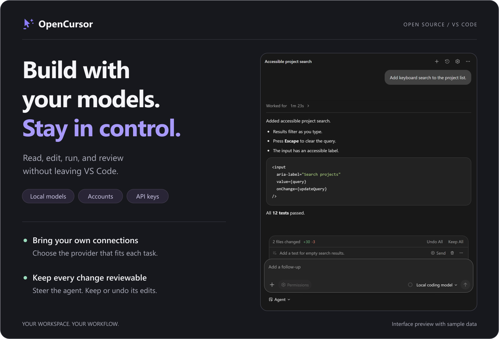
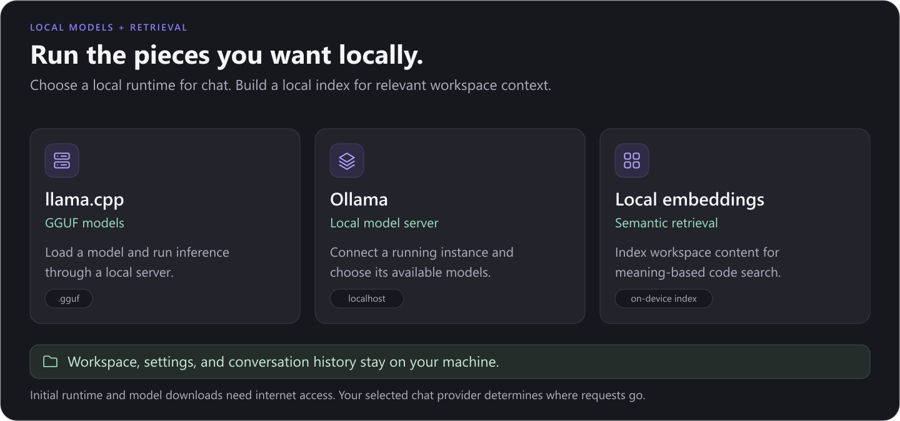
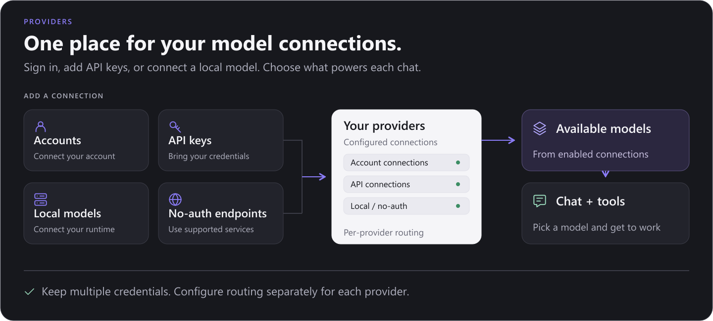

<div align="center">



<br/>

**The open-source AI coding agent for VS Code & Terminal — built local-first.**

Chat with an agent that reads your workspace, edits files, runs commands, and searches your codebase semantically. Use your Claude / ChatGPT / Gemini subscription, any API key, or run **completely offline** with llama.cpp and Ollama.

[Install](#installation) · [Terminal CLI](#-terminal-cli-agent-oc) · [Local AI & SearXNG](#-100-local-ai--searxng) · [IPC Bridge Architecture](#-ipc-bridge--architecture) · [Rules & Skills](#-workspace-rules--agent-skills) · [Providers](#-providers) · [Features](#-what-it-does) · [Contributing](#contributing)

</div>

---

## 💻 Terminal CLI Agent (`oc`)

OpenCursor includes a powerful standalone CLI agent (`oc` / `open-cursor`) that works directly from your terminal, similar to Claude Code or Cursor CLI.


### REPL & Single-Prompt Usage

```bash
# Launch interactive REPL mode (like Claude Code)
oc

# Execute a single prompt with agent tools
oc "Fix the failing test in auth.test.ts"

# Run in specific mode with auto-approval
oc -m debug -y "Find why the socket connection drops on timeout"

# Select model and working directory
oc --model claude-3-7-sonnet --cwd ./packages/backend "Refactor user controller"
```

### IPC Bridge vs Standalone Engine

- **Connected Mode**: If VS Code with the OpenCursor extension is open, `oc` connects to the extension host via an IPC Unix socket (`/tmp/opencursor-ipc.sock`) or Windows Named Pipe (`\\.\pipe\opencursor-ipc`). Output streams live to both VS Code and your terminal.
- **Standalone Mode**: If VS Code is not running, `oc` automatically falls back to its embedded Node runtime host using a headless `vscode` shim. Set `OPEN_CURSOR_WORKSPACE_ROOT` to target any workspace root.

---

### 🛠️ 47+ CLI Subcommands

OpenCursor CLI packs 47 specialized subcommands for automated software engineering:

| Command | Category | Description |
|---|---|---|
| `oc` | **REPL** | Interactive terminal agent session |
| `oc fix` | **Debug** | Auto-diagnose & fix the last failed terminal command or runtime error |
| `oc scaffold [type]` | **Scaffold** | Generate project boilerplate (React, Next.js, Express, FastAPI) |
| `oc review [target]` | **Review** | Deep AI code review with `CRITICAL`, `MAJOR`, `MINOR` severity ratings |
| `oc diagram [target]` | **Diagram** | Generate Mermaid & ASCII architecture flowcharts |
| `oc types [file]` | **TypeScript** | Infer missing TypeScript types & eliminate `any` usage |
| `oc trace [error]` | **Debug** | Analyze stack trace root cause and apply patch |
| `oc ci-monitor [url]` | **CI/CD** | Real-time GitHub Actions / GitLab CI pipeline monitor |
| `oc feature-flag [name]` | **Feature** | Generate feature flag integration code |
| `oc context [out]` | **Context** | Dump workspace context to structured JSON |
| `oc craft-prompt [task]` | **Prompt** | Craft optimized LLM system prompts with few-shot examples |
| `oc deploy [target]` | **DevOps** | Generate production deployment runbooks and scripts |
| `oc logs [file]` | **Logs** | Analyze log files for errors, anomalies, and regressions |
| `oc validate [file]` | **Schema** | Validate JSON / Zod / OpenAPI schemas & output fixes |
| `oc license` | **Audit** | Scan dependency licenses for GPL / AGPL copyleft contamination |
| `oc hooks [install]` | **Git** | Install & configure git pre-commit/commit-msg hooks |
| `oc monorepo [sub]` | **Monorepo** | Manage monorepo workspace dependency graphs |
| `oc translation-sync` | **i18n** | Sync locale files & flag missing/stale translations |
| `oc graphql [schema]` | **API** | Generate TypeScript types & resolvers from GraphQL schema |
| `oc cache` | **Perf** | Analyze & suggest Redis / CDN / memory caching strategies |
| `oc rollback` | **DevOps** | Generate production rollback plan & shell scripts |
| `oc knowledge [query]` | **Docs** | Query local workspace knowledge base |
| `oc graph [file]` | **Index** | Build & inspect code dependency graph index |
| `oc diff [target]` | **TUI** | Interactive terminal diff viewer |
| `oc undo` | **Snapshot** | Manage & restore workspace undo snapshots |
| `oc browser [url]` | **Browser** | Headless browser execution & test automation |
| `oc codemod [pattern]` | **Codemod** | AST codemod transformation engine |
| `oc test-watch` | **Testing** | Continuous test runner & watch daemon |
| `oc devcontainer` | **DevOps** | Synthesize devcontainer configurations |
| `oc pr` | **Git** | Automated PR description & branch generator |
| `oc audit-secrets` | **Security** | SAST secret leak and hardcoded token audit |
| `oc loadtest [url]` | **Perf** | Generate K6 / Autocannon load testing scripts |
| `oc flaky [test]` | **Testing** | Detect and fix flaky unit / E2E tests |
| `oc shrink-docker` | **Docker** | Multi-stage Dockerfile optimization & image shrinker |
| `oc map-api` | **API** | REST & GraphQL route mapper |
| `oc explain [file]` | **Code** | Deep code explanation & ASCII sequence diagrams |
| `oc i18n [langs]` | **i18n** | Extract UI strings and generate localization files |
| `oc mock [type]` | **Mock** | Generate mock JSON data & MSW handlers |
| `oc migrate [desc]` | **Database** | Generate ORM schema migrations (Prisma, Drizzle, TypeORM) |
| `oc dependency` | **Security** | Audit outdated packages & supply chain risks |
| `oc lint-fix` | **Quality** | Run linter auto-fix engine & resolve warnings |
| `oc env` | **Env** | Synchronize `process.env` keys & update `.env.example` |
| `oc clean` | **Refactor** | Detect unused exports, dead code & orphan assets |
| `oc changelog` | **Release** | Generate conventional release `CHANGELOG.md` |
| `oc api <url> [method]` | **API** | Interactive REST / GraphQL API endpoint tester |
| `oc bundle` | **Build** | Analyze bundle size & tree-shaking optimizations |
| `oc benchmark-ci` | **CI/CD** | CI pipeline workflow benchmark generator |
| `oc accessibility` | **A11y** | Audit WCAG A11y violations & apply auto-patches |
| `oc storybook` | **UI** | Generate Component Storybook stories (`.stories.tsx`) |
| `oc telemetry` | **Analytics** | Inspect local agent execution telemetry |
| `oc watch` | **Daemon** | Background file watcher & continuous auto-fix daemon |
| `oc git <commit\|pr>` | **Git** | Git workflow automation & AI commit helper |
| `oc bench [target]` | **Perf** | Code performance & memory leak profiler |
| `oc docs [module]` | **Docs** | Generate JSDoc, OpenAPI & developer portal docs |
| `oc test [target]` | **Testing** | Generate AI unit and E2E test suites |
| `oc security` | **Security** | SAST vulnerability & security scanner |
| `oc refactor [goal]` | **Refactor** | Code refactoring & API modernizer |
| `oc voice` | **Voice** | Hands-free voice prompt engine |
| `oc container` | **DevOps** | Synthesize Dockerfile, Docker-Compose & K8s manifests |
| `oc db [query]` | **Database** | SQL/ORM schema & query optimization assistant |
| `oc swarm [task]` | **Swarm** | Multi-agent swarm team orchestrator |
| `oc plugin [list]` | **Plugins** | Custom plugin & extension manager |
| `oc models` | **Models** | List and inspect local GGUF and Ollama AI models |
| `oc add-rule <desc>` | **Rules** | Generate workspace rule under `.cursor/rules/` |
| `oc add-skill <name>` | **Skills** | Generate agent skill under `.cursor/skills/` |
| `oc completion [shell]` | **Shell** | Generate shell autocompletion script (`bash`, `zsh`, `fish`) |

---

## 🔌 100% Local AI & SearXNG



OpenCursor is designed to work **without internet** once set up:

- **🦙 llama.cpp built in** — search Hugging Face for GGUF models, pick a quantization, download, and OpenCursor spawns and manages `llama-server` for you. Full launch control: context size, GPU layers, flash attention, KV cache types, speculative decoding, vision (`--mmproj`), and more.
- **🐋 Ollama** — pull, manage, and chat with models from the Ollama library, zero config.
- **🧠 Local embeddings** — semantic codebase search powered by an on-device ONNX MiniLM model. No embedding API, no key, no code leaving your machine.
- **🔎 SearXNG Web Search** — search the web privately. Configure your self-hosted SearXNG endpoint in `~/.config/opencursor/config.json`:
  ```json
  {
    "searxng_url": "http://localhost:8080"
  }
  ```
  *(Falls back automatically to DuckDuckGo scraping if SearXNG is unconfigured or unreachable).*
- **✈️ Airplane-mode coding** — local model + local index = a fully working AI agent, offline.

---

## 🔗 IPC Bridge & Architecture

OpenCursor features a dual-target decoupled architecture:

```
┌────────────────────────────────────────────────────────┐
│                   Terminal CLI (oc)                    │
└───────────────────────────┬────────────────────────────┘
                            │ (Unix Socket / Pipe)
                            ▼
┌────────────────────────────────────────────────────────┐
│             OpenCursor IPC Socket Server               │
├───────────────────────────────────┬────────────────────┤
│       VS Code Extension Host      │   Headless Shim    │
│    (Full IDE UI & Diagnostics)    │  (Standalone CLI)  │
└───────────────────────────────────┴────────────────────┘
```

- **IPC Protocol**: Json-lines messaging over `/tmp/opencursor-ipc.sock` (Linux/macOS) or `\\.\pipe\opencursor-ipc` (Windows). Supports bidirectional prompt submissions, streaming deltas, approval requests, and multi-choice questions.
- **Headless VS Code Shim**: When running outside VS Code, `src/vscodeShim.ts` provides fallback implementations of workspace, window, Uri, and diagnostic channels.

---

## 🎯 Workspace Rules & Agent Skills

OpenCursor supports structured workspace directives and skills:

- **Workspace Rules** (`.cursor/rules/*.md`): Define project-wide coding standards, typing rules, and style requirements that are automatically included in agent context.
  - Create rules via CLI: `oc add-rule "Enforce strict TypeScript typing and no implicit any"`
- **Agent Skills** (`.cursor/skills/<name>/SKILL.md`): Modular capabilities and specialized domain instructions.
  - Create skills via CLI: `oc add-skill django-api "Guidelines for Django REST framework endpoints"`

---

## 🌐 Providers



- **OAuth sign-in** — connect your existing **Claude Code**, **OpenAI Codex**, or **Google Antigravity** account and use your subscription's models directly.
- **API keys** — OpenAI, Anthropic, Gemini, OpenRouter presets out of the box with automatic rate limit reset retries (`X-RateLimit-Reset`).
- **Custom providers** — add any OpenAI-compatible or Anthropic-style endpoint (base URL + key). Run multiple providers at once; models are fetched live and mixable in the picker.
- **Auto mode** — a judge model routes each task to the best enabled model. Per-model reasoning effort, thinking mode, and context-size options.

---

## ⚡ What it does

| | |
|---|---|
| 💬 **Agent chat & REPL** | Sidebar chat in VS Code and interactive terminal REPL (`oc`) with streaming markdown |
| 🛠️ **25+ core tools** | Read/write/edit, shell execution, grep/glob, semantic search, SearXNG/DDG web search, notebooks, subagents, MCP |
| 🧰 **47 CLI tools** | Code review, diagramming, security audit, database assistant, codemod engine, devcontainer synthesis, docker shrinker, and more |
| ✅ **Inline review** | Per-hunk **Keep / Undo** CodeLenses on every agent edit — no git required |
| 🧭 **Modes** | Agent · Ask · Plan · Debug · Multitask · Project (Ask/Plan are read-only) |
| 🛡️ **Approval policy** | Per-action allow/ask/review/deny with risk heuristics (`rm -rf`, `sudo`, `.env`, secrets…) and wildcard allow/deny lists |
| 🔗 **MCP & IPC Bridge** | Full MCP client, 11 lifecycle hooks, custom subagents, and IPC socket server for terminal integration |
| 🖼️ **Images & PDFs** | Paste screenshots, read images and PDFs directly into context |
| 📜 **Rules & Skills** | Support for `.cursor/rules` guidelines and `.cursor/skills` custom workflows |

---

## Installation

### 1. VS Code Extension
1. Install **OpenCursor** from the VS Code Marketplace (or grab the `.vsix` from [Releases](https://github.com/PawanOsman/OpenCursor/releases)).
2. Open the OpenCursor sidebar and pick a provider.

### 2. Terminal CLI (`oc`)
To use the CLI globally from your terminal:
```bash
cd OpenCursor
pnpm link --global
```
Now `oc` and `open-cursor` commands are available in your shell.

Generate shell completion for your environment:
```bash
# zsh
oc completion zsh > ~/.zsh/completion/_oc

# bash
oc completion bash > ~/.bash_completion.d/oc
```

---

## Building from source

```bash
git clone https://github.com/PawanOsman/OpenCursor.git
cd OpenCursor
pnpm install
pnpm run compile   # or: pnpm run watch
```

Build a packaged `.vsix` extension and standalone CLI binary:
```bash
pnpm run package
pnpm run vsix
```

The compiled CLI binary is located at `./dist/cli.js`. You can invoke it directly via:
```bash
node dist/cli.js --help
```

---

## Contributing

Issues and PRs welcome — see [issues](https://github.com/PawanOsman/OpenCursor/issues).

---

## License

[MIT](LICENSE)
