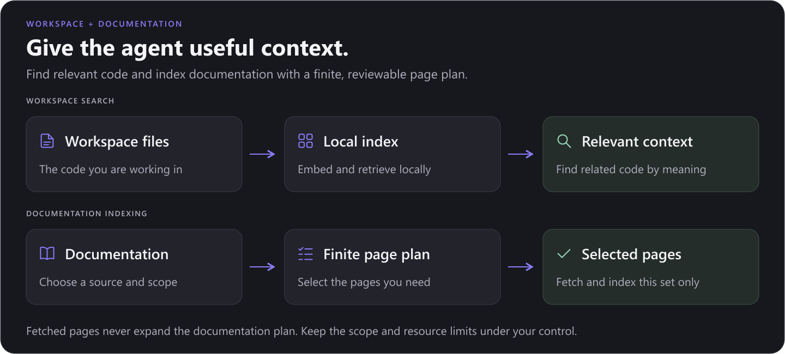

<!--
Copyright (c) 2026 Pawan Osman <https://github.com/PawanOsman>

This file is part of OpenCursor, AI coding agent chat inside VS Code.
https://github.com/PawanOsman/OpenCursor

Licensed under the MIT License. See LICENSE file in the project root.
-->

# OpenCursor

**An open-source AI coding agent for VS Code. Bring your models, work in your workspace, and stay in control of the changes.**

<p align="center">
  
</p>

<p align="center">
  <a href="https://marketplace.visualstudio.com/items?itemName=pkrd.ocursor">Install for VS Code</a> ·
  <a href="https://github.com/PawanOsman/OpenCursor/releases">Releases</a> ·
  <a href="#quick-start">Quick start</a> ·
  <a href="#development">Build from source</a> ·
  <a href="#credits">Credits</a>
</p>

OpenCursor brings conversation, code exploration, file edits, terminal commands, and change review into your editor. Connect a supported account, use your own API keys, or run a local model with Ollama or llama.cpp. Choose the model and permissions that fit the task, then follow the work as it happens.

## Quick start

1. **Install OpenCursor Agent** from the [VS Code Marketplace](https://marketplace.visualstudio.com/items?itemName=pkrd.ocursor). You can also download a `.vsix` from [Releases](https://github.com/PawanOsman/OpenCursor/releases) and run **Extensions: Install from VSIX**. Requires VS Code 1.96 or newer.
2. **Connect a model.** Open the OpenCursor sidebar, then Settings. Add an account or API provider under **Providers**, or configure **Ollama** or **llama.cpp** for local inference.
3. **Choose a model and start a conversation.** Enable the models you want in **Models**, select one in the composer, and describe your task. Use `Ctrl+L` on Windows/Linux or `Cmd+L` on macOS to add an editor selection to chat.
4. **Review the result.** Inspect tool activity and file changes, then keep or undo the edits. Adjust the permission controls to decide which actions need your approval.

Some features download native runtimes or model files when first used. Prepare those downloads before working offline.

## From a prompt to a reviewed change

| Capability | What you can do |
| --- | --- |
| **Workspace-aware chat** | Mention files, folders, selections, documentation, terminal output, and Git context. Keep separate conversations in tabs with saved drafts and searchable history. |
| **Rich messages** | Write Markdown directly in the composer, paste images, preview attachments, and use highlighted code blocks with a selected language or automatic detection. Messages support both RTL and LTR content. |
| **Visible progress** | Follow collapsible work activity, tool calls, task lists, and subagents. Completed work keeps its summary easy to find. |
| **Follow-ups and steering** | Queue another request, edit or reorder queued messages, steer an active run, or send a new request immediately to interrupt it. |
| **Tools for implementation** | Read and edit files, search code, run terminal commands, inspect language symbols, and verify browser behavior. |
| **Change review** | Inspect changed files and review individual hunks in the editor. Use **Keep All** or **Undo All** when you are ready. |

Switch between **Agent**, **Ask**, **Plan**, **Project**, and **Multitask** modes. Ask is read-only; Plan can save a plan without editing project code. Agent carries out changes under your configured permissions. You can also fork or archive conversations and delegate independent work to subagents.

## Connect the models you want


| Connection | Examples | Setup |
| --- | --- | --- |
| **Accounts** | Claude Code, OpenAI Codex, Google Antigravity, Gemini CLI, GitHub Copilot, Kiro, Kimi Code, and more | Choose a provider in **Add Account** and follow its browser, device-code, or token-import flow. |
| **API providers** | OpenAI, Anthropic, Google Gemini, OpenRouter, xAI, DeepSeek, Moonshot/Kimi, Z.ai, MiniMax, Qwen, Groq, Mistral, Together, and Fireworks | Add a provider and one or more API keys. |
| **Custom providers** | Your own OpenAI-compatible or Anthropic-compatible endpoint | Set the base URL, credentials if required, and models. |
| **Local models** | Ollama and llama.cpp | Connect to Ollama or manage a llama.cpp runtime and GGUF models. |
| **No-auth providers** | OpenCode Free | Add the connection without entering an account or key. |

Only configured API providers appear in your provider list. The Models page shows enabled, connected providers so you can focus on the connections you actually use.

**Multiple accounts and keys.** Connections of the same provider are grouped together with their own balancing settings. Select first-available or round-robin routing; supported account providers also expose quota-aware choices. Eligible failures can move to another credential before response content starts.

**Options that match the model.** The catalog and provider discovery expose available models with supported reasoning, thinking, and context controls. Use **Settings > Models** to inspect and enable the models available through your connections. Availability and tool support depend on the provider and account; a catalog entry does not grant access to a model.

**Choose processing speed.** Supported GPT and Claude models offer **Standard** and **Fast** in the model picker. Standard is the default. Fast requests priority processing without changing your reasoning setting and can use extra credits or higher API rates. Your account and endpoint must support it; custom gateways must forward the speed setting to the upstream provider.

## Run locally


### llama.cpp

Search for GGUF models, choose a quantization, download the files, and manage the model server from Settings. Configure context size, GPU layers, KV cache, and other launch options. Runtime health, download progress, cancellation, and model-fit guidance help you see what is happening on your machine.

### Ollama

Connect to an Ollama endpoint, browse installed models, pull new ones, and load or unload them. OpenCursor shows server health and the model capabilities reported by the runtime.

### Local inference and retrieval

Use an on-device model together with local embeddings to work without a hosted model API. Once the required models and runtimes are installed, local coding and code search can work offline. Web search, online documentation fetching, and remote integrations still require their respective services.

## Give the agent relevant context



**Search by meaning and by text.** Semantic retrieval combines embeddings with lexical matches to find useful code, even when the question uses different words from the implementation. The index updates incrementally, accounts for unsaved editor content, and checks that retrieved snippets are current. Local embeddings are available by default; a compatible hosted embedding endpoint is optional.

**Index documentation with a defined scope.** Add a documentation source in **Settings > Indexing & Docs**, choose a page or section, and optionally specify topics and excluded paths. Discovery builds a finite page plan from the source, navigation, `llms.txt`, and bounded sitemap discovery. AI-assisted selection can narrow that plan using your configured model.

Fetched pages do not add more links to the plan. Request, download, and time limits bound each run; duplicate content is filtered and unchanged embeddings can be reused. If an update fails, the previous usable index is preserved. Reference indexed documentation with `@Docs` when it is relevant to your task.

## Adapt the workflow

- **Instructions and skills:** use scoped workspace instructions, rules, reusable skills, and personas to guide how the agent works.
- **MCP and hooks:** connect tools and resources through local or remote MCP servers, and run hooks around supported lifecycle events.
- **Subagents and goals:** delegate work, follow background tasks, and track an objective with an optional token budget.
- **Worktrees and execution:** use isolated Git worktrees for separate tasks or configure Docker command execution when you need it.
- **Plugins and remote jobs:** install local plugin bundles or submit work to a configured worker and review the exported patch.

Language navigation uses installed VS Code language providers, browser tools require an installed browser, and Docker execution requires a running engine and an existing image. Remote jobs use a configured worker and a committed repository revision; applying the returned patch is a separate review step.

## Your data and connections

Conversations, drafts, indexes, and edit-recovery data are stored locally by the extension. API keys and account tokens use **VS Code SecretStorage**.

Model inference runs at the endpoint you choose. Hosted models and embeddings receive the context needed for their requests; documentation fetching, browser tools, MCP servers, hooks, and remote workers use the services you configure or invoke. For a local workflow, select local inference and embeddings and keep external tools disabled when you do not need them.

## Development

Use Node.js 22, pnpm, Git, and VS Code to build the extension.

```bash
git clone https://github.com/PawanOsman/OpenCursor.git
cd OpenCursor
pnpm install --frozen-lockfile
pnpm run compile
```

Open the repository in VS Code and press `F5` to launch the Extension Development Host. Use `pnpm run watch` while developing, or `pnpm run vsix` to create an installable package.

### Checks

```bash
pnpm run check-types
pnpm run lint
pnpm run test:unit
```

Additional checks include `pnpm run test:runtime`, `pnpm run test:host`, and `pnpm run test:worker`. These exercise runtime installation, extension activation, and worker execution. Live provider checks require configured credentials.

### Preview the interface

After compiling, start the local preview:

```bash
pnpm run preview:ui
```

Open `http://127.0.0.1:4173`. The preview renders the production chat and settings UI with sample data and a mock VS Code bridge. Try `/?state=conversation&theme=light&width=380` for a narrow chat or `/?view=settings&theme=dark&width=1200` for settings.

README artwork lives in [`media/readme`](media/readme). The SVG sources are editable, and the PNG exports keep the visuals compatible with GitHub and the Marketplace. Run `node scripts/render-readme-diagrams.cjs` to regenerate the diagrams. With the preview running, run `node scripts/render-readme-hero.cjs` to refresh the interface artwork.

## Contributing

Bug reports, documentation improvements, provider fixes, and pull requests are welcome. [Open an issue](https://github.com/PawanOsman/OpenCursor/issues) with steps to reproduce the problem, your VS Code version, and the relevant provider or runtime. Remove credentials and private workspace content from any logs or screenshots you share.

For code changes, include focused verification and screenshots when the interface changes. Keep pull requests scoped so the behavior and its validation are easy to review.

## License

OpenCursor is available under the [MIT License](LICENSE).

## Credits

- **[Codex](https://github.com/openai/codex)** by OpenAI inspired OpenCursor's interface design, styling, and interaction patterns.
- **[9router](https://github.com/decolua/9router)** provided the foundation for the provider integrations and account authentication support adapted into OpenCursor.

Thank you to these projects and their contributors.
